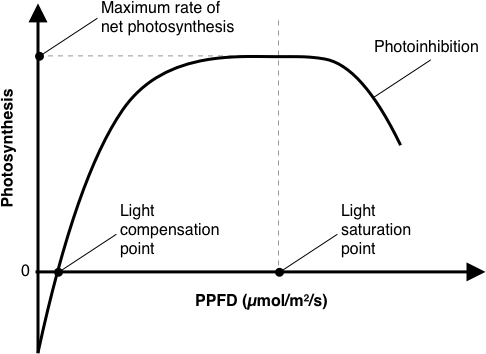
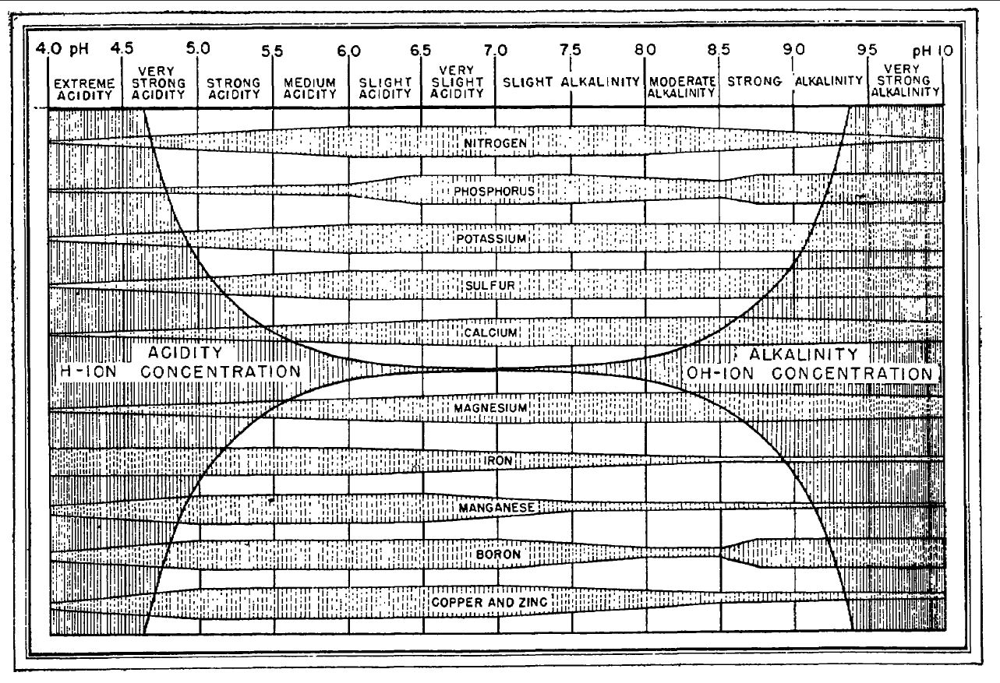

# Vegetable Gardening for Engineers

This is a starting point for understanding how to grow vegetables at home. I created this document out of dissatisfaction with popular gardening books (too little detail) and social media (too much talking and clickbait). I found myself organizing and synthesizing concepts, data, and advice from disparate sources. I even turned to material from agricultural university extension programs, crop guides from commercial seed and fertilizer companies, high school biology courses, live farmer training courses and gardening workshops, and techniques from indoor cannabis growers.

This document reflects my personal learning journey over the past years. You are welcome to submit pull requests or email me with feedback.

Currently the focus is on indoor and balcony growing in an urban apartment setting. Therefore, only container gardening and hydroponics are covered. Garden beds, composting, aquaponics, fungiculture, permaculture are not covered (yet).

## Table of Contents

This document is organized broadly in three parts:

1. 🍎 Concepts
    1. [☯️ Environmental parameters](#☯️-Environmental-parameters)
    1. [🌱 Growth stages](#🌱-Growth-stages)
    1. [☀️ Light](#☀️-Light)
    1. [🌡 Temperature](#🌡-Temperature)
    1. [⛽️ Nutrition](#⛽️-Nutrition)
    1. [🤎 Soil](#🤎-Soil)
    1. [💧 Water](#💧-Water)
1. 🔢 Data
1. 🛠 Techniques & Resources

The first part provides a conceptual understanding of the science of growing vegetables. The second part features tables of data ("VegTable") for many garden crops. It answers basic questions about crop selection. The third part is a collection of links about well-known growing systems, techniques, and other resources.

## 🍎 Concepts

### ☯️ Environmental parameters

There are some environmental parameters relevant to every plant:

Parameter | Measurement | Unit | Zone
--- | --- | --- | ---
**Light** | [Daily Light Integral (DLI)](https://en.wikipedia.org/wiki/Daily_light_integral)* | mol/m²/day | Light
**Temperature** | Air temperature* | °C | Air
Humidity | [Relative Humidity (RH)](https://en.wikipedia.org/wiki/Relative_humidity) | % | Air
Wind | [Wind speed](https://en.wikipedia.org/wiki/Wind_speed) | m/s | Air
Carbon dioxide (CO₂) | Carbon dioxide | ppm | Air
**Nutrients** | [Electrical Conductivity (EC)](https://en.wikipedia.org/wiki/Conductivity_(electrolytic))* | μS/cm | Soil/Water
**pH** | [pH](https://en.wikipedia.org/wiki/PH)* | pH | Soil/Water
Temperature | Root-zone temperature | °C | Soil/Water
Oxygen (O₂) | [Dissolved Oxygen (DO)](https://en.wikipedia.org/wiki/Oxygen_saturation) | ppm | Soil/Water
Water redox potential | [Oxidation-reduction potential (ORP)](https://en.wikipedia.org/wiki/Reduction_potential) | mV | Water
Water hardness | [Degree of hardness](https://en.wikipedia.org/wiki/Hard_water#Measurement) | various | Water

\* key measurements for small-scale systems

Why are these relevant? Plants perform two critical processes which are complementary: 

* Plants convert light energy into storable chemical energy (carbohydrates) during **photosynthesis**. In other words: ☀️ Light energy + 💨 Carbon dioxide + 💧 Water → 🔋 Stored energy + 💨 Oxygen
* Plants use the stored energy (carbohydrates) to fuel growth, in a process called **respiration**. In other words: 🔋 Stored energy + 💨 Oxygen → 💨 Carbon dioxide + 💧 Water

*[Light](#☀️-Light)* is the single most important environmental parameter as it literally provides energy for plant growth. 

*[Temperature](#🌡-Temperature)* dictates a plant’s metabolic rate and therefore also strongly influences growth rate. 

Additionally, there is another critical process:

* The evaporation of water through a plant’s leaves pulls water (containing dissolved nutrients) up from the roots. This is a passive process called **transpiration**.

*[Soil pH](#pH)* is sometimes called a “master variable” as it affects the solubility of soil nutrients (among other things, including microbial activity) and therefore nutrient availability, hence plant growth.

Air *humidity*, *wind*, and *[temperature](#🌡-Temperature)* all affect the rate of transpiration and therefore also plant growth.

Environments:

* In an indoor system, the environmental parameters are mostly controlled. Limiting factors are likely 1) light, 2) space (area), 3) water, 4) nutrition, 5) oxygen (for soil-less systems and compact soils).
* In an outdoor system, think about sun, wind, temperature, water access, soil conditions. Look for planting calendars and first/last frost dates.

#### More about plant biology

* Mary M. Pratt, _Practical Science for Gardeners_, 2005.
* Khan Academy, "Cellular respiration", https://www.khanacademy.org/science/biology/cellular-respiration-and-fermentation
* Khan Academy, "Photosynthesis", https://www.khanacademy.org/science/biology/photosynthesis-in-plants

### 🌱 Growth stages

Stage | Description | Labor
--- | --- | ---
Germination (Stage 1) | Sowing to radicle (root) emergence | -
Germination (Stage 2) | "Sprout": Radicle emergence to expansion of cotyledons (false leaves) | -
Germination (Stage 3) | "Seedling": Cotyledon expansion to vegetative growth | -
Vegetative | Growth of all true leaves | Transplant
Flowering | From first flowering to first fruit set | Pollinate*
Fruiting* | From first fruit set to growth, ripening, and first harvest | -
Maturity | From first harvest to the end of last harvest | Harvest

\* fruiting crops only

### ☀️ Light

#### Light Quality

*Light quality* refers to the distribution of wavelengths (colors) in a light. The part of the light spectrum most relevant to photosynthesis is 400–700 nm. This range is named [Photosynthetically Active Radiation (PAR)](https://en.wikipedia.org/wiki/Photosynthetically_active_radiation).

Historically it was believed that plants only used red and blue light. It is now understood that green light, as well as far-red and ultraviolet light, which are both outside PAR, can all affect plant development. Specifically, far-red (FR) light, which penetrates leaves, can tell plants that they are under a canopy and promote growth, whereas blue-violet and ultraviolet light, which are abundant in the sky, can [inhibit growth](https://en.wikipedia.org/wiki/Crown_shyness).

Shopping advice:

* Color temperature, measured in Kelvin (K), is only relevant to humans, not plants.
* Buy a full-spectrum light, not a red-blue ("blurple") light. Although there is research on the effects of changing light quality during growth, it is generally sufficient to use the same constant full-spectrum light from start to finish.

#### Light Quantity

The rate of plant growth scales to *light quantity* (intensity). However, below a certain quantity (the *light compensation point*), there is not enough energy to fuel growth. On the other side, above a certain quantity (the *light saturation point*), plants become damaged. Tolerance levels vary from crop to crop (see the Data section).

Light quantity is measured in various ways, with a key metric being [Daily Light Integral (DLI)](https://en.wikipedia.org/wiki/Daily_light_integral).

Measurement | Unit | Meaning
--- | --- | ---
Photosynthetic Photon Flux (PPF) | μmol/s | The amount of PAR (400–700 nm light) emitted from a source per second.
Photosynthetic Photon Flux Density (PPFD) | μmol/m²/s | The amount of PAR that reaches a destination per second.
Daily Light Integral (DLI) | mol/m²/day | The amount of PAR that cumulatively reaches a destination in one day.

PPFD and DLI are spot measurements. They are always relative to a specific distance from the light source.

To calculate DLI, multiply _PPFD_ × _hours of light per day_ ("photoperiod") × 1/1000000 mol/μmol × 3600 sec/hour.

Shopping advice:

* Lumens, lux, and foot-candles are only relevant to humans, not plants.
* Ask for PPFD maps, which show PPFD measurements at various points across a surface for a given lamp height. As an example, the [IKEA VÄXER E27 10W grow bulb](https://www.ikea.com/gb/en/p/vaexer-led-bulb-for-cultivation-par30-e27-60317483/) is capable of producing [>250 PPFD over a 6.5 cm radius area at 30 cm height](https://www.ledtonic.com/blogs/guides/ppfd-test-of-household-bulbs-ikea-10w-grow-bulb-t5-cfl). If you run it for 16 hours/day, the DLI is 14.4 mol/m²/day (see above calculation). This is sufficient for lettuce, which requires 14–17 DLI, but not tomatoes, which require 22–30 DLI.
* Plant DLI requirements are for total light, including sunlight, so you may be able to provide less supplemental light.
* A quantum meter is used to measure PPFD. Apps such as [Korona](https://apps.apple.com/us/app/korona-plant-light-meter/id1450079523) (iOS) can be used as low-cost alternatives. See also MIGRO, "Android Smartphone PAR meter hack", September 25, 2019, https://www.youtube.com/watch?v=AjkEJjlzGv8.

#### Photoperiodism

[Photoperiodism](https://en.wikipedia.org/wiki/Photoperiodism) refers to how the light cycle affects plant growth and flowering. *Short-day plants* (e.g. lettuce) only flower when days are shorter than a certain length, *long-day plants* (e.g. mung beans) only flower when days are longer than a certain length, and *day-neutral plants* (e.g. tomatoes) flower based on other conditions.

#### More about plant lighting

* Fluence By OSRAM, https://fluence.science/science-articles/
* AlboPepper, "PAR Light Quality LEDs & HID: Plant Grow Light Basics -101 (pt 1)", August 17, 2017, https://www.youtube.com/watch?v=O3dxjk_E2Ac
* Bruce Bugbee, "PAR, PPF, PPFD, and PFD Explained", June 27, 2019, https://www.youtube.com/watch?v=UZO8Fb0ryW8
* Bruce Bugbee, "Cannabis Grow Lighting Myths and FAQs with Dr. Bruce Bugbee", Jan 9, 2020, https://www.youtube.com/watch?v=ID9rE5JewVg
* Ledtonic, "DLI (Daily Light Integral) Chart - Understand your plants' PPFD & photoperiod requirements", May 28, 2019, https://www.ledtonic.com/blogs/guides/dli-daily-light-integral-chart-understand-your-plants-ppfd-photoperiod-requirements
* Khan Academy, "Plant responses to light", https://www.khanacademy.org/science/biology/plant-biology#plant-responses-to-light-cues

### 🌡 Temperature

Every plant has a base (minimum) temperature (_T𝘣𝘢𝘴𝘦_), an optimal temperature (_T𝘰𝘱𝘵_), and an maximum temperature (_T𝘮𝘢𝘹_). These temperature ranges can vary across [growth stages](#🌱-Growth-stages).

Crucially, there is a tradeoff between growth rate and growth quality. Higher temperatures can result in faster growth but also thinner stems, weaker roots, and less flavor. Furthermore, gases become less soluable at higher temperatures, increasing the risk of oxygen deficiency.

Key air temperature measurements are as follows:

Measurement | Unit
--- | ---
Average daily temperature (ADT) | °C
Difference between day and night temperature (DIF) | °C
[Growing degree days (GDD)](https://en.wikipedia.org/wiki/Growing_degree-day) | °C-day

Higher DIF can result in taller plants with weaker stems (stem elongation).

Unlike air temperatures, root-zone temperatures need to be relatively stable.

Plants can be grouped according to their tolerance for cold temperatures:

* cool season ("cold-tolerant")
* intermediate ("cold-temperate")
* warm season ("cold-sensitive")

#### More about plant temperature

* Christopher Currey, "Find your just-right temperature", Oct 3, 2016, https://www.producegrower.com/article/hydroponic-production-primer-temperature/
* Roberto Lopez, "Effects of Temperature on Greenhouse Crops", Purdue University, http://www.e-gro.org/pdf/206.pdf

### ⛽️ Nutrition

Plants require 17 [essential nutrients](https://en.wikipedia.org/wiki/Plant_nutrition) ("[minerals](https://en.wikipedia.org/wiki/Mineral_(nutrient))") for survival.

Of these, plants obtain carbon (C), hydrogen (H), and oxygen (O) freely from air (CO₂ and O₂) and water (H₂O).

The remaining nutrients are obtained from the soil (or alternative growing medium) in the form of [salts](https://en.wikipedia.org/wiki/Salt_(chemistry)). This happens through multiple processes: by the root physically growing in contact with the nutrients ("root interception"), by dissolved nutrients flowing through the soil solution to the root ("mass flow"), and by dissolved nutrients diffusing through the soil solution to the depleted soil next to the plant root ("diffusion").

Nitrogen (N), phosphorus (P), and potassium (K) are required in the largest amounts; commercial fertilizers are labeled with N-P-K ratios.

Nitrogen is a key ingredient in many plant substances, including chlorophyll. However, potassium is used by fruiting crops (such as tomatoes) even more heavily than nitrogen, as evidenced in the following diagram showing the [macronutrient uptake across time for a tomato plant](https://www.haifa-group.com/crop-guide/vegetables/tomato/crop-guide-tomato-plant-nutrition): 

#### Electrical Conductivity (EC)

A [EC meter](https://en.wikipedia.org/wiki/Electrical_conductivity_meter) measures electrical conductivity, which is an indicator of the amount of dissolved nutrients (mineral salts) in a solution. 

Notes:

* EC cannot be used to determine the amounts or ratios of specific nutrients.
* A [Total Dissolved Solids (TDS)](https://en.wikipedia.org/wiki/Total_dissolved_solids) meter measures the amount of all kinds of dissolved solids (inorganic as well as organic) in a solution. Essentially it is an EC meter which performs an output conversion to TDS, measured in ppm. Be aware that the conversion factor varies across reference materials and nutrient suppliers in different applications and countries. For measuring hydroponic nutrients, the best approach is to use only EC, not TDS.

#### pH

[pH](https://en.wikipedia.org/wiki/PH) is the measure of acidity or alkalinity (basicity) of a solution, where acidic refers to having a high concentration of hydrogen ions (H⁺).

Soil pH is highly important as it affects the bioavailability of nutrients to plants.

#### Shopping advice

* An entry-level EC meter (e.g. _HM Digital EC-3_) costs 20–30 USD.
* An entry-level pH meter (e.g. _Apera Instruments PH20_) costs 50–60 USD; a professional-level pH meter (e.g. _Bluelab pH Pen_) costs over 100 USD. You also need to buy liquid products for cleaning, storing (pH probes must be stored in a buffer solution), and calibrating the highly sensitive pH probe. These may be sold together as a kit. Be sure to get a pH meter with a replaceable probe. Even if unused, the pH electrode has a lifespan of only 6–18 months.
* As an alternative to buying a pH meter, start with pH indicator drops, litmus paper, or even homemade red cabbage juice.
* Reputable instrument manufacturers include [Apera Instruments](https://aperainst.com/) (US), [Bluelab](https://www.bluelab.com/) (NZ), [Hanna Instruments](https://www.hannainst.com/) (IT), [HM Digital](http://hmdigital.com/) (KR), [Milwaukee Instruments](https://milwaukeeinstruments.com/) (US), and [Oakton Instruments](http://www.4oakton.com/) (US).

#### More about plant nutrition

* Jeff Lowenfels, _Teaming with Nutrients: The Organic Gardener’s Guide to Optimizing Plant Nutrition_, 2013.
* Mary M. Pratt, _Practical Science for Gardeners_, 2005.
* NM State University, "Science of Agriculture: Cation Exchange", https://scienceofagriculture.org/ch-cation.php
* Khan Academy, "Acids, bases, and pH
* Khan Academy, "Biogeochemical cycles", https://www.khanacademy.org/science/biology/ecology#biogeochemical-cycles
", https://www.khanacademy.org/science/biology/water-acids-and-bases

### 🤎 Soil

Soil can be understood from three simultaneous perspectives:

* **Physically**: Soil is a mixture of solids, liquids, and gases: typically 50% water, dissolved minerals, and various gases held in [pores](https://en.wikipedia.org/wiki/Pore_space_in_soil), 45% inorganic particles (sand, silt, and clay), and 5% organic matter ("[soil organic matter](https://en.wikipedia.org/wiki/Soil_organic_matter)"). *[Soil texture](https://en.wikipedia.org/wiki/Soil_texture)* is determined by the exact proportion of sand (most coarse), silt, and clay (most fine) particles.
* **Chemically**: Soil is effective an aqueous solution containing dissolved minerals (nutrients) along with organic and inorganic particles. The particles commonly have negative charges, which attract nutrients with positive charges (cations). This allows the soil to hold and release certain nutrients. The nutrient holding capacity of a soil is called the [cation-exchange capacity (CEC)](https://en.wikipedia.org/wiki/Cation-exchange_capacity).

* **Biologically**: Soil is an ecosystem of microbes, including bacteria and mycorrhizal fungi. See Jeff Lowenfels, _Teaming with Microbes: The Organic Gardener’s Guide to The Soil Food Web_ and _Teaming With Fungi: The Organic Grower’s Guide to Mycorrhizae_

### 💧 Water

TBD

* https://en.wikipedia.org/wiki/Hard_water

## 🔢 Data

TBD

See also: companion planting, succession planting, crop rotation

## 🛠 Techniques & Resources

### Hydroponics

Techniques:

* Kratky (passive) - best for leafy greens at small-scale
* NFT - best for leafy greens at large-scale
* Bato Bucket - best for fruiting crops at small- to medium-scale
* DWC/Raft - best for aquaponics

More about hydroponics:

* https://generalhydroponics.com/knowledgebase
* http://howardresh.com/
* http://blogs.cornell.edu/cornellcea/
* https://scienceinhydroponics.com/
* http://www.e-gro.org/ - focused on commercial greenhouses

Online courses:

* [Upstart University](https://university.upstartfarmers.com/) - paid, focused on commercial hydroponic or aquaponic production

Automation:

* DFRobot: [Build KnowFlow: automatic water monitor](https://www.dfrobot.com/blog-733.html), [How to Make An Automatic Water Changing System](https://www.dfrobot.com/blog-679.html)

### Container gardening

* Seed starter soil vs planting soil
* Fungus gnats: https://ucanr.edu/blogs/blogcore/postdetail.cfm?postnum=25318

Online courses:

* [GIY (Grow It Yourself)](https://www.giy.ie/) (Ireland) - free 12 week course
* [Vegetable Academy](https://www.vegetableacademy.com/) (Canada) - free/paid

Automation:

* Xiaomi Flower Care (MiFlora) sensors: https://github.com/vrachieru/xiaomi-flower-care-api
* DFRobot: [EcoDuino - An Auto Planting Kit](https://www.dfrobot.com/product-641.html)

### Backyard/allotment gardening

Methodologies:

* [Square Foot Gardening](https://squarefootgardening.org/) by Mel Bartholomew
* [GROW BIOINTENSIVE Sustainable Mini-Farming](http://growbiointensive.org/) by John Jeavons and Ecology Action
* [SPIN Gardening](http://spingardening.com/) by Wally Satzewich, Gail Vandersteen, Roxanne Christensen

Techniques:

* Hügelkultur
